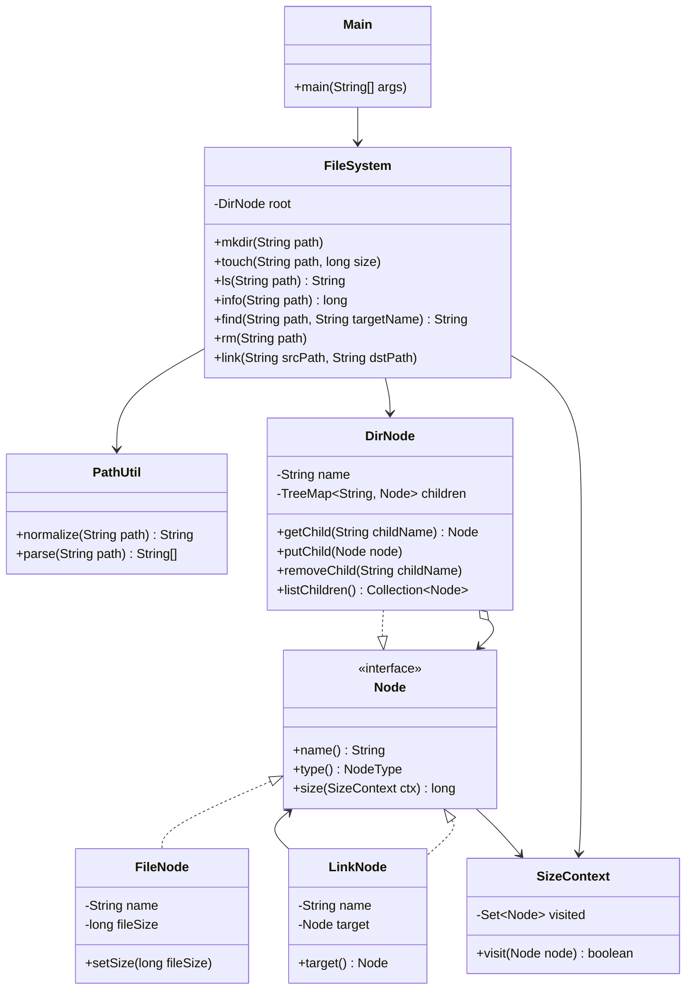

# 系统架构设计文档

## 1. 小组信息

- Gradescope 账号 name：Shupeng He
- Gradescope 账号邮箱：231250122@smail.nju.edu.cn
- 组员：
  - 贺舒鹏，231250122
  - 陈志楠，231250181
  - 时铭泽，231820103

## 2. 系统目标与范围

本系统实现一个微型内存文件系统。程序从标准输入逐行读取命令，在内存中维护文件、目录和链接节点之间的关系，并把查询结果输出到标准输出。系统不访问真实磁盘，所有文件系统状态只在一次程序运行期间有效。

本次迭代支持以下命令：

- `MKDIR <path>`：创建目录。
- `TOUCH <path> <size>`：创建或覆盖文件，并保存文件大小。
- `LS <path>`：列出目录直接子节点，或输出文件、文件链接对应名称。
- `INFO <path>`：计算文件、目录或链接可达内容的大小。
- `FIND <path> <name>`：从指定节点开始递归查找同名节点，并按字典序输出路径。
- `RM <path>`：删除文件、链接或空目录。
- `LINK <srcPath> <dstPath>`：在目标路径创建指向已有节点的链接。

系统支持绝对路径规范化，会处理冗余 `/`、`.`、`..` 和非根路径末尾的 `/`。失败操作和非法输入均直接忽略，不输出错误信息。

## 3. 核心架构

代码分为命令分发、路径处理、文件系统核心逻辑和节点模型四部分。

- `Main`：命令读取与分发模块。它使用 `Scanner` 读取标准输入，根据命令名调用 `FileSystem` 的对应方法，并负责输出 `LS`、`INFO`、`FIND` 的返回结果。
- `PathUtil`：路径规范化模块。它把输入路径转换为规范绝对路径，并进一步解析为路径段数组。
- `FileSystem`：文件系统核心模块。它保存根目录 `root`，实现七条命令，并封装父目录解析、末段目录项解析、链接跟随、递归查找、删除和覆盖等逻辑。
- `Node`：节点统一接口。文件、目录、链接都实现 `name()`、`type()`、`size(SizeContext ctx)`，因此目录可以用统一集合保存不同类型的子节点。
- `FileNode`：文件节点，保存文件名和大小。
- `DirNode`：目录节点，保存直接子节点，并负责递归计算目录大小。
- `LinkNode`：链接节点，保存链接自身名称和目标节点引用。
- `SizeContext`：大小统计上下文，记录一次 `INFO` 中已经访问过的底层节点。
- `NodeType`：节点类型枚举，包括 `FILE`、`DIR`、`LINK`。

## 4. 关键数据结构

内存文件系统以 `DirNode root = new DirNode("")` 表示根目录。根目录不是普通目录项，因此不能被创建、替换或删除。

目录节点 `DirNode` 使用 `TreeMap<String, Node>` 保存直接子节点。`String` 键表示目录项名称，`Node` 值表示对应节点对象。`TreeMap` 让子节点天然按字典序排列，因此 `LS` 输出目录内容时可以直接遍历 `children.values()`。

文件节点 `FileNode` 保存 `name` 和 `fileSize`。当 `TOUCH` 作用于已有文件时，系统直接更新该对象的 `fileSize`；当目标路径原来是目录或链接时，系统在父目录中放入新的 `FileNode`，替换原目录项。

链接节点 `LinkNode` 保存 `name` 和 `target`。`name` 是链接自身在父目录中的目录项名称，`target` 是指向的底层节点对象。链接不复制目标内容，而是共享目标节点。例如 `LINK /data /alias` 后，`/data` 和 `/alias` 可以到达同一个 `DirNode` 对象。

系统没有额外分配数字节点 ID，而是直接使用 Java 对象引用区分底层节点。`SizeContext` 里的 `HashSet<Node>` 记录已经统计过的节点对象，从而识别“多个路径指向同一个底层节点”的情况。

链接场景下，“目录项名称”和“目标节点名称”可能不同。例如 `LINK /data.bin /copy` 创建的链接目录项名是 `copy`，但目标文件节点名仍然是 `data.bin`。因此 `LS /copy` 指向文件时输出链接自身名称 `copy`，而不是目标文件原名。

## 5. 关键算法与边界处理

### 5.1 路径规范化

所有命令进入文件系统核心逻辑前都会调用 `PathUtil.parse`。`parse` 先调用 `normalize`：

- 路径为空或不是以 `/` 开头时，返回 `null`。
- 用 `/` 切分路径，并忽略空段，因此 `//usr///local` 等价于 `/usr/local`。
- 忽略 `.`。
- 遇到 `..` 时弹出上一个路径段；如果已经在根目录，则仍保持在根目录。
- 规范化后没有路径段时返回 `/`，解析结果为空数组。

例如 `/a//b/./c/../` 会被规范化为 `/a/b`。

### 5.2 路径解析与链接跟随

`FileSystem` 内部使用三种解析方法：

- `resolveParentDir`：解析目标路径的父目录。中间路径段如果是链接，会通过 `followLinks` 跟随到最终目标；最终目标必须是目录，才能继续向下解析。
- `resolveNode`：解析完整路径并跟随末段链接，返回最终文件或目录节点。`INFO` 和 `LINK` 的源路径使用该方法。
- `resolveEntry`：解析完整路径但保留末段目录项本身。`FIND` 使用该方法，这样链接节点自身的名称也能参与匹配。

`followLinks` 通过循环持续读取 `LinkNode.target()`，直到得到非链接节点。这样可以支持链接指向另一个链接的情况。

### 5.3 INFO 大小统计与去重

`INFO` 对目标节点调用 `size(new SizeContext())`。计算规则如下：

- 文件节点：如果当前文件对象没有统计过，返回文件大小；否则返回 0。
- 目录节点：如果当前目录对象没有统计过，遍历所有子节点并累加大小；否则返回 0。
- 链接节点：不计算链接自身大小，直接返回目标节点大小。

由于多个目录项可能通过链接到达同一个底层文件或目录，`SizeContext` 使用 `HashSet<Node>` 记录已访问节点，避免一次 `INFO` 中重复计数。

### 5.4 LS 查询

`LS` 先解析目标路径，再根据目标目录项类型输出：

- 文件：输出文件自身名称。
- 目录：输出直接子节点名称，每行一个。
- 链接：先跟随链接。若目标是文件，输出链接自身名称；若目标是目录，输出目标目录的直接子节点。

目录子节点由 `TreeMap` 保存，因此输出满足字典序。路径不存在时返回 `null`，主程序不输出内容。

### 5.5 FIND 递归搜索

`FIND` 是本系统中最需要处理链接语义的查询。实现流程如下：

1. 使用 `resolveEntry` 解析起点，保留起点目录项本身。
2. 使用 `followLinks` 得到起点实际指向的文件或目录。
3. 调用 `findRecursive(entry, actual, currentPath, targetName, expanded, results)` 递归查找。
4. 每次递归先比较 `entry.name()` 和目标名称。如果相等，把当前路径加入结果。因此链接节点自身也可以作为匹配结果。
5. 如果 `actual` 是目录，则尝试把该目录对象加入 `expanded`。如果已经展开过，则停止继续展开，避免共享目录被重复遍历。
6. 遍历目录子节点时，先处理普通文件和普通目录，再处理链接节点。这样当真实目录和链接目录同时可达同一底层目录时，优先保留真实目录路径；同时链接节点仍会被检查并在必要时展开。
7. 对每个子节点都调用 `followLinks` 得到实际节点，再递归处理。因此如果目录中遇到“链接到目录”的节点，系统会进入该链接指向的目录继续搜索。
8. 所有结果收集后使用 `Collections.sort` 排序，再拼接为多行字符串输出。

这个设计同时满足三类要求：文件起点只检查自身，目录起点递归检查子树，链接节点既能按自身名称匹配，也能在指向目录时继续展开。

### 5.6 RM 删除规则

`RM` 不允许删除根目录。普通路径会先解析父目录并取得目标目录项：

- 文件：直接从父目录删除。
- 链接：只删除链接目录项，不影响被链接目标。
- 目录：只有空目录才能删除；非空目录删除请求被忽略。

如果路径非法、父目录不存在或目标不存在，命令直接忽略。

### 5.7 覆盖语义

系统采用“父目录目录项替换”的模型处理覆盖：

- `TOUCH` 到已有文件时，更新该文件大小。
- `TOUCH` 到已有目录或链接时，用新的 `FileNode` 替换该目录项。
- `MKDIR` 到已有目录时，保持不变。
- `MKDIR` 到已有文件或链接时，用新的空 `DirNode` 替换该目录项。
- `LINK` 到已有文件、目录或链接时，用新的 `LinkNode` 替换该目录项。

覆盖只改变父目录中的一个目录项，不会修改其他路径已经引用的底层节点。

### 5.8 非法命令和失败操作

系统对非法输入和失败操作采取忽略策略，不输出错误信息。典型情况包括：

- 路径不是绝对路径。
- 父目录不存在。
- 中间路径解析后不是目录。
- 查询、删除或链接源路径不存在。
- `TOUCH` 的大小不是合法非负整数。
- 对根目录执行创建、删除或链接目标创建。
- 删除非空目录。
- 未识别的命令。

主程序只在 `LS`、`INFO`、`FIND` 产生非空有效结果时打印内容。

## 6. 测试说明

项目测试代码位于 `se-sys-desgin/test` 目录，包括 `PathUtilTest`、`MkdirTest`、`TouchTest`、`LsTest`、`InfoTest`、`FindTest`、`RmTest`、`LinkTest` 和 `IntegrationTest`。

测试覆盖的主要场景包括：

- 基础创建、覆盖、列表查询和大小查询。
- 路径规范化，包括冗余 `/`、`.`、`..`、尾斜杠和相对路径。
- 删除文件、删除空目录、拒绝删除非空目录、拒绝删除根目录。
- 从文件、目录和根目录执行 `FIND`。
- `FIND` 匹配文件、目录、链接自身名称。
- `FIND` 从链接目录起点搜索，以及在普通目录内部遇到链接目录后继续搜索。
- 链接到文件、链接到目录、通过链接路径修改目标目录。
- `INFO` 在多个链接共享同一底层节点时避免重复计数。
- 迭代一和迭代二题面中的综合输入输出样例。
